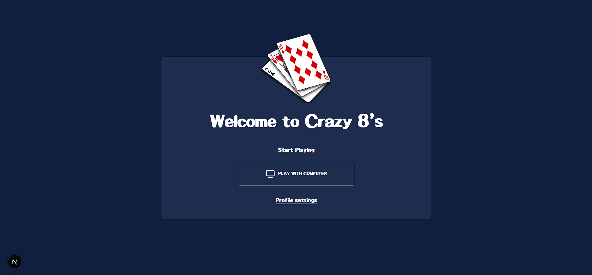
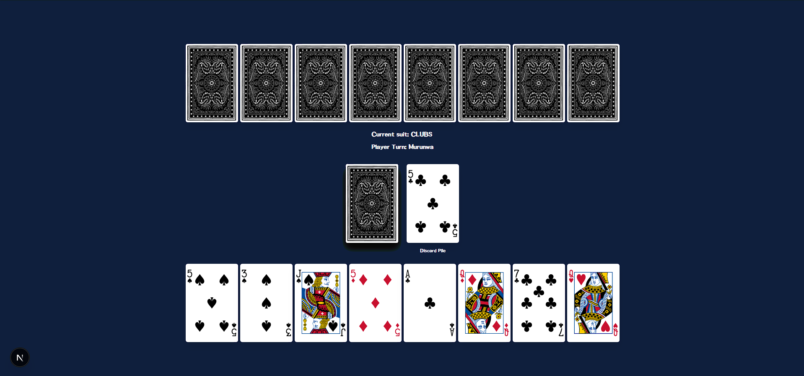
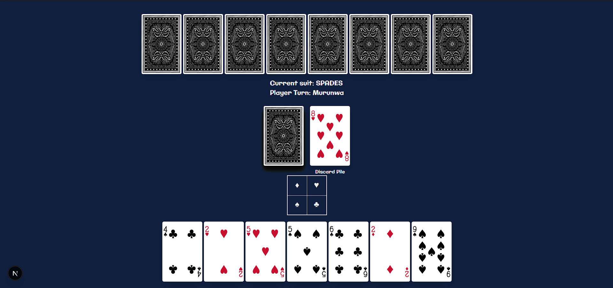
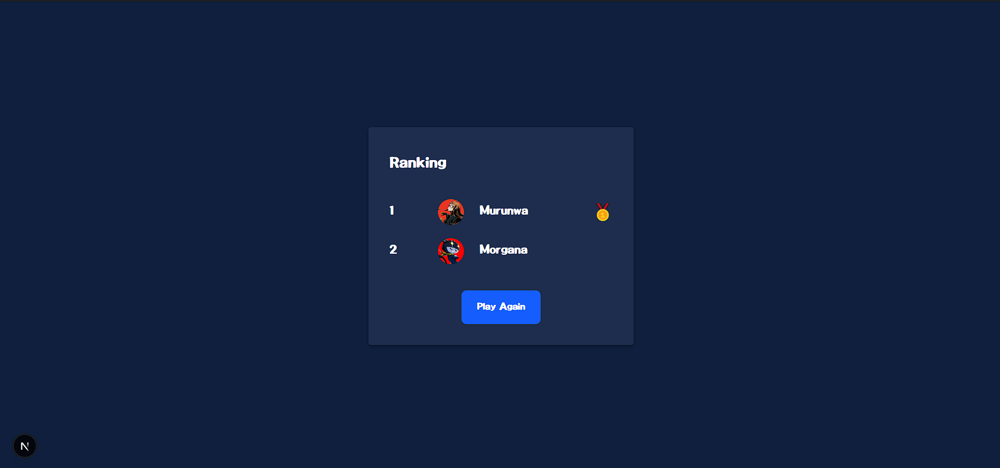

# Crazy Eights



Crazy Eights is a shedding-style card game. The goal is simple, get rid of all the cards in your hand before the other player.

---
## Project Setup

Follow these steps to run Crazy Eights locally:

1. **Clone the repository**  
```bash
git clone https://github.com/MurunwaMaphiri1/crazy-8s-multiplayer.git
cd crazy-8s-multiplayer
```

2. **Install Dependencies**
```bash
cd Client
npm install
cd Server
npm install
```

3. **Start the development server**
```bash
cd Client
npm run dev
```

4. **Open the game in your browser**
- Navigate to http://localhost:5173 (or the URL shown in the terminal)
---

5. **Run multiplayer server**
```bash
cd Server
npx ts-node index.ts
```
---

## Objective



Play cards from your hand to the discard pile by matching either the **suit** or the **value** of the top card.  
First player to empty their hand wins the round.

---

## Setup

- Standard 52-card deck  
- Each player starts with **8 cards**
- One card is placed face-up to start the discard pile
- Remaining cards form the draw pile

---

## Turns

On your turn, you may:

1. **Play a card** that matches the suit or value of the top discard  
2. **Play an Eight (8)** to change the suit  
3. **Draw a card** if you cannot play  

A valid play ends your turn unless a special card effect says otherwise.

---

## Special Cards

| Card | Effect |
|------|--------|
| **2** | Next player must draw 2 cards |
| **Jack** | Skips the next player's turn |
| **8** | Wild card. Player chooses a new suit |

> If the draw pile runs out, the discard pile (except the top card) is reshuffled into a new deck.

---

## Suit Change Component



- The suit chosen after an 8 becomes the active suit  
- Normally only one card per turn

---

## Winning the Round



- A player wins when they have **no cards left**
- Remaining players keep their cards  

---

## Multiplayer demo


## Future Improvements🧠

- Add More players
- Add card sounds and animations

---

Have fun, and may your hand be full of Eights at just the right dramatic moment.
